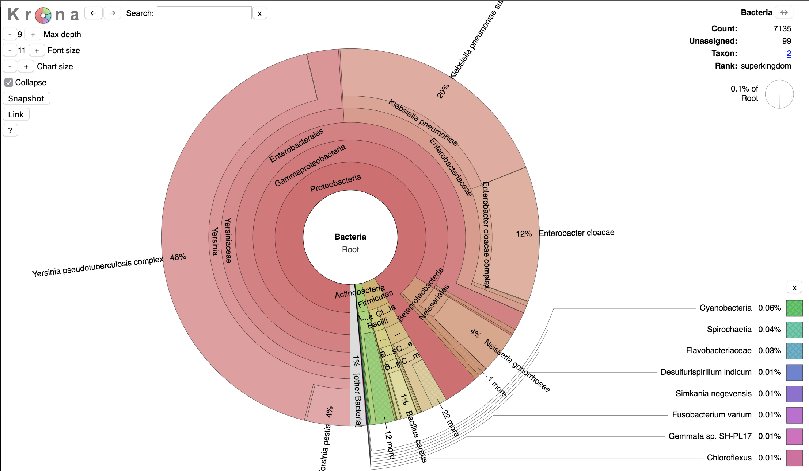

#####################################
Metagenomic screening of shotgun data
#####################################
  
  
********
Kraken 2
********

In this hands-on session we will use Kraken 2 to screen the metagenomic content of an ancient sample. The first version of Kraken (see :ref:`kraken_label`) uses a large indexed and sorted list of k-mer/LCA pairs as its database, which may be problematic for users due to the large memory requirements. For this reason `Kraken 2`_ was developed.
Kraken 2 is fast and requires less memory, BUT false positive errors occur in less than 1% of queries (confidence scoring thresholds can be used to call out to detect them).
The first version of Kraken use a large indexed and sorted list of k-mer/LCA pairs as its database, which may be problematic for users due to the large memory requirements. For this reason `Kraken 2`_ was developed.
Kraken 2 is fast and requires less memory, BUT the database false positive errors occur in less than 1% of queries (confidence scoring thresholds can be used to call out to detect them).
The default (or standard) database size is 29 GB (as of Jan. 2018, in Kraken 1 the standard database is about 200 GB!), and you will need slightly more than that in RAM if you want to build it.
By default, Kraken 2 will attempt to use the dustmasker or  segmasker programs provided as part of NCBI's BLAST suite to mask low-complexity regions.

A Kraken 2 database is a directory containing at least 3 files:

  - **hash.k2d**: Contains the minimizer to taxon mappings
  - **opts.k2d**: Contains information about the options used to build the database
  - **taxo.k2d**: Contains taxonomy information used to build the database
  
Other files may also be present as part of the database build process, and can, if desired, be removed after a successful build of the database.

  .. _Kraken 2: https://ccb.jhu.edu/software/kraken2/index.shtml

Minikraken2
***********
We will first use a pre-built 8 GB Kraken database, called `Minikraken2`_, constructed from complete dusted bacterial, archaeal, and viral genomes in RefSeq. You can download the pre-built `Minikraken2`_ database from the program's website with ``wget``, and extract the archive content with ``tar``: 
You can download the pre-built `Minikraken2`_ database (containing bacteria, viral and archaea sequences) from the website with ``wget``, and extract the archive content with ``tar``: 

  .. _Minikraken2: https://ccb.jhu.edu/software/kraken2/index.shtml?t=downloads

::

  wget ftp://ftp.ccb.jhu.edu/pub/data/kraken2_dbs/minikraken2_v1_8GB_201904_UPDATE.tgz
  tar -xvzf minikraken2_v1_8GB_201904_UPDATE.tgz

To classify the reads in a ``fastq`` file against the Minikraken2 database, you can run this command: 
::
  
  kraken2 --db minikraken2_v1_8GB filename.fastq.gz --gzip-compressed --output filename.kraken --report filename.kraken.report
  
Some of the options available in Kraken 2: 

====================== =====================================================
Option                 Function
====================== =====================================================
**--use-names**        Print scientific names instead of just taxids
**--gzip-compressed**  Input is gzip compressed  
**--report** <string>  Print a report with aggregrate counts/clade to file
**--threads**          Number of threads (default: 1)
====================== =====================================================

.. note:: 

  - In Kraken 2 you can generate the reports file by typing the ``--report`` option (followed by a name for the report file to generate) in the command used for the classification.
  - In order to run later Krona, the Kraken output file must contain taxids, and not scientific names. So if you want to run Krona do not call the option ``--use-names``.
  

The Kraken 2 report format, like Kraken 1, is tab-delimited with one line per taxon. There are six fields, from left to right: 

  1. Percentage of fragments covered by the clade rooted at this taxon
  2. Number of fragments covered by the clade rooted at this taxon
  3. Number of fragments assigned directly to this taxon
  4. A rank code, indicating (U)nclassified, (R)oot, (D)omain, (K)ingdom,
     (P)hylum, (C)lass, (O)rder, (F)amily, (G)enus, or (S)pecies.
     Taxa that are not at any of these 10 ranks have a rank code that is
     formed by using the rank code of the closest ancestor rank with
     a number indicating the distance from that rank.  E.g., "G2" is a
     rank code indicating a taxon is between genus and species and the
     grandparent taxon is at the genus rank.
  5. NCBI taxonomic ID number
  6. Indented scientific name

.. _krona-label:

Visualization of data with Krona
******************************** 

Finally, we can visualize the results of the Kraken2 analysis with `Krona`_, which disaplys hierarchical data (like taxonomic assignation) in multi-layerd pie charts. 
The interactive charts created by Krona are in the ``html`` format and can be viewed with any web browser. 
We will convert the kraken output in html format using the program ``ktImportTaxonomy``, which parses the information relative to the query ID and the taxonomy ID. 

  .. _Krona: https://github.com/marbl/Krona/wiki

::
  
  ktImportTaxonomy -q 2 -t 3 filename.kraken -o filename.kraken.html

Some of the options available in ktImportTaxonomy:

================ ========
Option           Function
================ ========
**-q** <integer> Column of input files to use as query ID.
**-t** <integer> Column of input files to use as taxonomy ID.
**-o** <string>  Output file name.
================ ========

.. note:: If you want to analyze multiple kraken files from various samples you view the results in one single html file running ``ktImportTaxonomy`` as follows:
  ::
    
    ktImportTaxonomy -q 2 -t 3 filename_1.kraken filename_2.kraken ... filename_n.kraken -o all_samples.kraken.html

Kraken 2 Custom Database
************************

We have already created a custom database to use in this hands-on session so we can go straight to the classification (step 4). However, we report here all the commands to build a Kraken2 database (steps 1-3). 

1. The first step is to create a new folder that will contain your custom database (choose an appropriate name for the folder-database, here we will call it ``CustomDB``). 
   Then we have to install a taxonomy. Usually, you will use the NCBI taxonomy. The following command will download in the folder ``/taxonomy`` the accession number to taxon maps, as well as the taxonomic name and tree information from NCBI:
   ::
   
     kraken2-build --download-taxonomy --db CustomDB

2. Install one or more reference libraries. Several sets of standard genomes (or proteins) are available, which are constantly updated (see also the Kraken `website`_).

     .. _website: https://ccb.jhu.edu/software/kraken2/index.shtml?t=manual#installation)
   
     - archaea: RefSeq complete archaeal genomes/proteins
     - bacteria: RefSeq complete bacterial genomes/proteins
     - plasmid: RefSeq plasmid nucleotide/protein sequences
     - viral: RefSeq complete viral genomes/proteins
     - human: GRCh38 human genome/proteins
     - fungi: RefSeq complete fungal genomes/proteins
     - plant: RefSeq complete plant genomes/proteins
     - protozoa: RefSeq complete protozoan genomes/proteins
     - nr: NCBI non-redundant protein database
     - nt: NCBI non-redundant nucleotide database
     - env_nr: NCBI non-redundant protein database with sequences from large environmental sequencing projects
     - env_nt: NCBI non-redundant nucleotide database with sequences from large environmental sequencing projects
     - UniVec: NCBI-supplied database of vector, adapter, linker, and primer sequences that may be contaminating sequencing projects and/or assemblies
     - UniVec_Core: A subset of UniVec chosen to minimize false positive hits to the vector database
   
   You can select as many libraries as you want and run the following command, which will download the reference sequences in the folder ``/library``, as follows:
   ::
   
     kraken2-build --download-library bacteria --db CustomDB
     kraken2-build --download-library viral --db CustomDB
     kraken2-build --download-library plasmid --db CustomDB
     kraken2-build --download-library fungi --db CustomDB
   
   In a custom database, you can add as many ``fasta`` sequences as you like. For exmaple, you can download the organelle genomes in ``fasta`` files from the `RefSeq`_ website with the commands ``wget``:
   
     .. _RefSeq: https://www.ncbi.nlm.nih.gov/genome/organelle/ 
   
   ::
   
     wget ftp://ftp.ncbi.nlm.nih.gov/refseq/release/mitochondrion/mitochondrion.1.1.genomic.fna.gz
     wget ftp://ftp.ncbi.nlm.nih.gov/refseq/release/mitochondrion/mitochondrion.2.1.genomic.fna.gz

   The downloaded files are in compressed in the ``gz`` format. To unzip them run the ``gunzip`` command:
   ::
     
     gunzip mitochondrion.1.1.genomic.fna.gz
     gunzip mitochondrion.2.1.genomic.fna.gz
   
   Then you can add the ``fasta`` files to your library, as follows:
   ::
   
     kraken2-build --add-to-library mitochondrion.1.1.genomic.fna --db CustomDB
     kraken2-build --add-to-library mitochondrion.2.1.genomic.fna --db CustomDB
  
3. Once your library is finalized, you need to build the database (here we set a maximum database size of 8 GB (you must indicate it in bytes!) with the ``--max-db-size`` option). 
   ::
     
     kraken2-build --build --max-db-size 8000000000 --db CustomDB
   
   .. warning::
   
     Kraken 2 uses two programs to perform low-complexity sequence masking, both available from NCBI: ``dustmasker``, for nucleotide sequences, and  ``segmasker``, for amino acid sequences. 
     These programs are available as part of the NCBI BLAST+ suite. If these programs are not installed on the local system and in the user's PATH when trying to use ``kraken2-build``, the database build will fail. 
     Users who do not wish to install these programs can use the ``--no-masking`` option to kraken2-build in conjunction with any of the ``--download-library``, ``--add-to-library``, or ``--standard`` options; use of the ``--no-masking`` option will skip masking of low-complexity sequences during the build of the Kraken 2 database.
   
   
   The ``kraken2-inspect`` script allows users to gain information about the content of a Kraken 2 database. You can pipe the command to ``head``, or ``less``.
   ::
     
     kraken2-inspect --db path/to/dbfolder | head -5
  
4. Finally, we can run the classification of the reads against the custom database with the ``kraken2`` command:
   ::
     
     kraken2 --db CustomDB filename.fastq.gz --gzip-compressed --output filename.kraken --report filename.report

5. To visualize the results of the classification in multi-layerd pie charts, use ``Krona``, as described in the section 3.1.2: `Visualization of data with Krona`_

.. note::

  Recently, a novel metagenomics classifier, `KrakenUniq`_, has been developed to reduce false-positive identifications in metagenomic classification.
  KrakenUniq combines the fast k-mer-based classification of Kraken with an efficient algorithm for assessing the coverage of unique k-mers found in each species in a dataset. 
  On various test datasets, KrakenUniq gives better recall and precision than other methods and effectively classifies and distinguishes pathogens with low abundance from false positives in infectious disease samples. 

    .. _KrakenUniq: https://github.com/fbreitwieser/krakenuniq

*******
Bracken
*******

Kraken and Kraken 2 classify reads to the best matching location in the taxonomic tree, but they do not estimate abundances of species. 
To do that we will use Bracken (Bayesian Reestimation of Abundance with KrakEN), which estimates the number of reads originating from each species present in a sample. Bracken computes probabilities that describe how much sequence from each genome in the Kraken database is identical to other genomes in the database, and combine this information with the assignments for a particular sample to estimate abundance at the species level, the genus level, or above. 
Bracken is compatible with both Kraken 1 and Kraken 2 (just note that the default kmer length is different, 31 in Kraken, 35 in Kraken 2).

 

Bracken from Minikraken 2
*************************

Prior to abundance estimation with Bracken, each reference genome contained in the Kraken database is divided into "read-length kmers", and each of these read-length kmers are classified. To do that, we need the **library** and **taxonomy** of the kraken database that we used for classification. This will generate a kmer distribution file, for examples for read-length kmers of 100 nucleotides: ``database100mers.kmer_distrib``. 
The kmer distribution file will be used for the following bracken analysis. 
As pre-built database, Minikraken already contains three kmer distribution files built at 100, 150, 200 kmers. 

================ ========
Option           Function
================ ========
**-i** <string>  Kraken report input file.
**-o** <string>  Output file name.
**-t** <string>  Classification level [Default = 'S', Options = 'D','P','C','O','F','G','S']: it specifies the taxonomic rank to analyze. Each classification at this specified rank will receive an estimated number of reads belonging to that rank after abundance estimation.
**-l** <string>  Threshold: it specifies the minimum number of reads required for a classification at the specified rank. Any classifications with less than the specified threshold will not receive additional reads from higher taxonomy levels when distributing reads for abundance estimation.
**-r** <string>  Read-length kmer used for the generations of Bracken distribution files (in Minikraken 100, 150, 200)
================ ========

To run Bracken on one sample we use the following command, with a threshold set at 10, and the read length set at 100 (so as to use the ``database100mers.kmer_distrib`` file inside the ``minikraken2_v1_8GB`` folder):
::

  bracken -d path/to/minikraken2_v1_8GB -i sample.kraken.report -o sample.bracken -r 100 -t 10
  

To speed the process, we can also use variables to set up the options and the paths to the minikraken database and other folders, and a ``for`` loop. We will generate taxonomic abundances at the species level (the default option). 
Remember to create first an output folder (with ``mkdir``). Also note that you can set as path variables either relative paths (based on your actual position and path) or absolute paths: 
::

  KRAKEN_DB=/path/to/kraken/db-folder
  OUTPUT=/path/to/output-folder
  READ_LEN=100
  THRESHOLD=0
  
  for i in $(find -name "*krk.report" -type f)
  do
    FILENAME=$(basename "$i")
    SAMPLE=${FILENAME%.krk.report}
    bracken -d $KRAKEN_DB -i $i -o $OUTPUT/${SAMPLE}.bracken -r $READ_LEN -t $THRESHOLD
  done

The Bracken output file is tab-delimited. There are seven fields, from left to right: 

  1. Name
  2. Taxonomy ID
  3. Level ID (S=Species, G=Genus, O=Order, F=Family, P=Phylum, K=Kingdom)
  4. Kraken Assigned Reads
  5. Added Reads with Abundance Reestimation
  6. Total Reads after Abundance Reestimation
  7. Fraction of Total Reads

Bracken from Custom databases
*****************************

The Minikraken database is available with all the files needed to run Bracken. If you used a custom database you must generate yourself the ``kmer_distrib`` file and the other Bracken database files with ``bracken-build``. 
To do that, we need the **library** and **taxonomy** of the kraken database that we used for classification. These are big size folders, but do not delete them if you plan to generate Braken databases in the future at different "read-length kmers".
You can select the "read-length kmers" that is most suitable for your samples (namely the average insert size of your library, e.g. 60 bp for ancient libraries). 
You can also generate several ``kmer_distrib`` files and make different runs (as in Minikraken run, where 100, 150 and 200 are available). 
You can find all the steps for generating the Bracken database files in the `Bracken manual`_. 

  .. _Bracken manual: https://ccb.jhu.edu/software/bracken/index.shtml?t=manual#step0

***********
Mataphlan 3
***********

MetaPhlAn is a computational tool that relies on ~1.1M unique clade-specific `marker genes`_ identified from ~100,000 reference genomes (~99,500 bacterial and archaeal and ~500 eukaryotic) to conduct taxonomic profiling of microbial communities (Bacteria, Archaea and Eukaryotes) from metagenomic shotgun sequencing data. MetaPhlAn allows: 

  .. _marker genes: https://www.dropbox.com/sh/7qze7m7g9fe2xjg/AAAlyQITZuUCtBUJxpxhIroIa/mpa_v30_CHOCOPhlAn_201901_marker_info.txt.bz2?dl=1

  - unambiguous taxonomic assignments;
  - an accurate estimation of organismal relative abundance;
  - species-level resolution for bacteria, archaea, eukaryotes, and viruses;
  - strain identification and tracking
  - orders of magnitude speedups compared to existing methods.
  - metagenomic strain-level population genomics

The basic usage of MetaPhlAn for taxonomic profiling is:
To basic usage of MetaPhlAn for taxonomic profiling is:
::

  metaphlan filename.fastq(.gz) --input_type fastq -o outfile.txt
  

.. note::
  MetaPhlAn relies on BowTie2 to map reads against marker genes. To save the intermediate BowTie2 output use ``--bowtie2out``, and for multiple CPUs (if available) use ``--nproc``:
  ::
  
    metaphlan filename.fastq(.gz) --bowtie2out filename.bowtie2.bz2 --nproc 5 --input_type fastq -o output.txt
  
  The intermediate BowTie2 output files can be used to run MetaPhlAn quickly by specifying the input (``--input_type bowtie2out``):
  ::
  
    metaphlan filename.bowtie2.bz2 --nproc 5 --input_type bowtie2out -o output.txt
    
  For more information and advanced usage of MetaPhlAn see the `manual`_ and the `wiki`_ page (available for MetaPhlAn 2 at the moment). 
  
    .. _manual: https://github.com/biobakery/MetaPhlAn/wiki/MetaPhlAn-3.0
    .. _wiki: https://github.com/biobakery/biobakery/wiki/metaphlan2